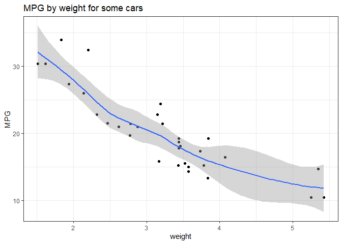

**My R Markdown Guide**
================
Jesse Birchfield
2023-11-20

------------------------------------------------------------------------

Welcome! Here is example code to do everything you might want to do in R
Markdown. Compare the raw `.Rmd` file with this output to see exactly
how it works.

# The YAML header

Let’s start with the document header:

- It’s between two sets of dashes `---`, and written in its own language
  called YAML (Yet Another Markup Language).
- The title, author, and date sections are optional; the document will
  still compile without them.
- You can put basic Markdown formatting inside the title or author.
- Note the R code inside backticks to display the current date.

Some options for output:

- output: html_document
- output: html_notebook
- output: md_document
- output: pdf_document
- output: word_document
- output: github_document

For html documents, and in some cases pdf or github documents, you can
add options as shown in this document, including:

- toc: true \# include table of contents
- toc_float: true \# make the TOC float on the left pane
- anchor_sections: true \# allow readers to click on anchors
- number_sections: false
- code_folding: show \# (‘hide’) collapse code chunks by clicking on
  them
- df_print: paged \# (‘default’ ‘kable’ ‘tibble’) method for printing
  dataframes
- dev: png \# (‘pdf’) graphics device for figure output
- citation_package: biblatex (‘default’ ‘natbib’)
- latex_engine: pdflatex \# (‘xelatex’ ‘lualatex’)

------------------------------------------------------------------------

# Section headings

Below the document header and between each section, I like to put a
blank line, followed by `---`, followed by another blank line, to create
a horizontal rule.

To separate paragraphs, put a blank line between them. Headers need a
blank line above, but not necessarily below. A single `#` precedes a
header the size of the title. For main section headings use `#`, for
subsections use `##`, and so on. You can go down to `######`. RMD can
use these to create a table of contents, discussed later.

------------------------------------------------------------------------

# Text formatting

To separate lines that are not new paragraphs, add two spaces to the end
of each line, like this:  
line1  
line2  
line3

Some basic formats:  
*italic*  
**bold**  
***italic and bold***  
~~strikethrough~~  
`console font for verbatim code`  
<https://www.google.com>

[This a link to Google.](https://www.google.com)

A couple special characters:  
en dash: –  
em dash: —

To display a literal character that would otherwise be used to format
text, add a backslash in front of the character:  
\* Without a backslash, this asterisk would be a bullet.

Ordered and unordered lists (must have blank line above):

1.  First item
2.  Second item
3.  Third item
    1.  Indented item
    2.  Indented item
4.  Fourth item

- First item
- Second item
- Third item
  - Indented item
  - Indented item
- Fourth item

Block quote (include `>` before each new line):

> Lorem ipsum dolor sit amet, consectetur adipiscing elit, sed do
> eiusmod tempor incididunt ut labore et dolore magna aliqua. Ut enim ad
> minim veniam, quis nostrud exercitation ullamco laboris nisi ut
> aliquip ex ea commodo consequat. Duis aute irure dolor in
> reprehenderit in voluptate velit esse cillum dolore eu fugiat nulla
> pariatur. Excepteur sint occaecat cupidatat non proident, sunt in
> culpa qui officia deserunt mollit anim id est laborum.

For a pagebreak, `\newpage`. Only shows up when you knit to PDF or print
the HTML.

------------------------------------------------------------------------

# Code chunks

If you write r, a space, and an R command, surrounded by backticks, the
command will be evaluated on the text line, in the regular text format.
Example: a three-decimal approximation of pi is 3.142.

Start an R code chunk with \`\`\`{r}. End it with \`\`\`. (It is
possible to write chunks in other languages too.) The options for the
chunk go inside the curly braces.

The first code chunk in your document should have `{r, setup, ...}`, as
in the below example. Inside `knitr::opts_chunk$set()` you can set
global options for all chunks. They can be overridden by individual
chunk headers.

``` r
# Also load packages, etc. in this chunk
# Usually set include=FALSE and message=FALSE
knitr::opts_chunk$set()
```

Some chunk options:

- label = ‘mychunk’ \# to refer to chunks by label
- include = FALSE \# run code, don’t display code or output
- eval = FALSE \# display code, don’t run it
- echo = FALSE \# run code, display output, don’t display code
- comment = ’’ \# remove `##` in front of the output
- collapse = TRUE \# combine all outputs
- message = FALSE \# show no messages of any kind

An invisible chunk:

A visible chunk that does nothing:

``` r
# You can see this code, but it won't run.
# This is useful for discussing code.
d <- dnorm(0, 0, 1)
```

Invisible code with visible output:

    ## [1] 0.3989423

Visible code with visible output:

``` r
dnorm(0, 0, 1)
```

    ## [1] 0.3989423

Remove the `##` in front of the output:

``` r
dnorm(0, 0, 1)
```

    [1] 0.3989423

If you don’t like the `[1]` in front of the output, try the `cat()` or
`glue()` functions.

------------------------------------------------------------------------

# Tables

Basic tibble print leaves much to be desired:

``` r
library(tidyverse)
A <- head(mtcars)
B <- tibble(A)
B
```

    # A tibble: 6 × 11
        mpg   cyl  disp    hp  drat    wt  qsec    vs    am  gear  carb
      <dbl> <dbl> <dbl> <dbl> <dbl> <dbl> <dbl> <dbl> <dbl> <dbl> <dbl>
    1  21       6   160   110  3.9   2.62  16.5     0     1     4     4
    2  21       6   160   110  3.9   2.88  17.0     0     1     4     4
    3  22.8     4   108    93  3.85  2.32  18.6     1     1     4     1
    4  21.4     6   258   110  3.08  3.22  19.4     1     0     3     1
    5  18.7     8   360   175  3.15  3.44  17.0     0     0     3     2
    6  18.1     6   225   105  2.76  3.46  20.2     1     0     3     1

Use the gt package (and you can do a lot more customization than this):

``` r
library(gt)
B %>% 
  gt() %>% 
  tab_options(table.align='left') %>%
  tab_header(
    title = 'Some car stuff',
    subtitle = 'Like weight and MPG') %>%
  opt_stylize(style = 5)
```

Unfortunately, gt doesn’t render in Github. Here is a way to show a
table in Github:

``` r
library(simplermarkdown)
md_table(A)
# Generate the table with md_table(), then copy and paste into text.
```

| mpg  | cyl | disp | hp  | drat | wt    | qsec  | vs  | am  | gear | carb |
|------|-----|------|-----|------|-------|-------|-----|-----|------|------|
| 21.0 | 6   | 160  | 110 | 3.90 | 2.620 | 16.46 | 0   | 1   | 4    | 4    |
| 21.0 | 6   | 160  | 110 | 3.90 | 2.875 | 17.02 | 0   | 1   | 4    | 4    |
| 22.8 | 4   | 108  | 93  | 3.85 | 2.320 | 18.61 | 1   | 1   | 4    | 1    |
| 21.4 | 6   | 258  | 110 | 3.08 | 3.215 | 19.44 | 1   | 0   | 3    | 1    |
| 18.7 | 8   | 360  | 175 | 3.15 | 3.440 | 17.02 | 0   | 0   | 3    | 2    |
| 18.1 | 6   | 225  | 105 | 2.76 | 3.460 | 20.22 | 1   | 0   | 3    | 1    |

------------------------------------------------------------------------

# Generated figures

It’s good practice to use a separate chunk to display a figure. Some
chunk options:

- fig.width \# in inches
- fig.height \# in inches
- out.width \# syntax ‘50%’, sets width relative to document
- out.height \# ditto
- fig.align \# ‘left’ ‘right’ ‘center’
- fig.cap \# caption

A fairly basic ggplot:

``` r
# Note, geom_smooth() generates a message, so we set message=FALSE.
g <- ggplot(mtcars, aes(x=wt, y=mpg)) + 
  theme_bw() +
  labs(title='MPG by weight for some cars', x='weight', y='MPG') +
  geom_point() + 
  geom_smooth()
g
```

<!-- -->

A smaller figure (50% linewidth), centered:

``` r
g
```


------------------------------------------------------------------------

# Imported images

To import an image, include it in your directory. The basic Markdown
method is this: `{width=25% height=25%}`.

If you want more control, however, use a code chunk with
`knitr::include_graphics()`, so you can exploit the chunk options:

``` r

```

The above doesn’t work for Github. You have to edit the .md file
directly and change the code to:

``` r
<p align="center">
  
</p>
```

------------------------------------------------------------------------

Happy downmarking!

—Jesse
