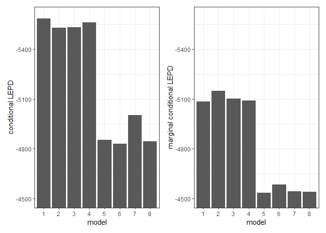

A multivariate longitudinal model with subject-varying effects for the
physical and mental progression of Alzheimer’s Disease
================
Jesse Birchfield, Robert Weiss, Andrew Holbrook

------------------------------------------------------------------------

This is the Github repo for the second chapter of my dissertation.

<table class="gt_table" data-quarto-disable-processing="false" data-quarto-bootstrap="false">
  <thead>
    <tr class="gt_heading">
      <td colspan="5" class="gt_heading gt_title gt_font_normal" style>Fit statistics across 8 models</td>
    </tr>
    <tr class="gt_heading">
      <td colspan="5" class="gt_heading gt_subtitle gt_font_normal gt_bottom_border" style>by 5-fold cross-validation, applied to MMSE outcome only</td>
    </tr>
    <tr class="gt_col_headings">
      <th class="gt_col_heading gt_columns_bottom_border gt_left" rowspan="1" colspan="1" scope="col" id="model">model</th>
      <th class="gt_col_heading gt_columns_bottom_border gt_left" rowspan="1" colspan="1" scope="col" id="other outcomes">other outcomes</th>
      <th class="gt_col_heading gt_columns_bottom_border gt_left" rowspan="1" colspan="1" scope="col" id="transformed MMSE">transformed MMSE</th>
      <th class="gt_col_heading gt_columns_bottom_border gt_left" rowspan="1" colspan="1" scope="col" id="conditional LEPD">conditional LEPD</th>
      <th class="gt_col_heading gt_columns_bottom_border gt_left" rowspan="1" colspan="1" scope="col" id="marginal conditional LEPD">marginal conditional LEPD</th>
    </tr>
  </thead>
  <tbody class="gt_table_body">
    <tr><td headers="model" class="gt_row gt_left">1</td>
<td headers="other outcomes" class="gt_row gt_left">FSLong</td>
<td headers="transformed MMSE" class="gt_row gt_left">FALSE</td>
<td headers="conditional LEPD" class="gt_row gt_left">-5586.3</td>
<td headers="marginal conditional LEPD" class="gt_row gt_left">-5086.1</td></tr>
    <tr><td headers="model" class="gt_row gt_left gt_striped">2</td>
<td headers="other outcomes" class="gt_row gt_left gt_striped">ANTsSST</td>
<td headers="transformed MMSE" class="gt_row gt_left gt_striped">FALSE</td>
<td headers="conditional LEPD" class="gt_row gt_left gt_striped">-5529.9</td>
<td headers="marginal conditional LEPD" class="gt_row gt_left gt_striped">-5149.0</td></tr>
    <tr><td headers="model" class="gt_row gt_left">3</td>
<td headers="other outcomes" class="gt_row gt_left">ECTavg</td>
<td headers="transformed MMSE" class="gt_row gt_left">FALSE</td>
<td headers="conditional LEPD" class="gt_row gt_left">-5531.8</td>
<td headers="marginal conditional LEPD" class="gt_row gt_left">-5103.1</td></tr>
    <tr><td headers="model" class="gt_row gt_left gt_striped">4</td>
<td headers="other outcomes" class="gt_row gt_left gt_striped">FSLong, ANTsSST</td>
<td headers="transformed MMSE" class="gt_row gt_left gt_striped">FALSE</td>
<td headers="conditional LEPD" class="gt_row gt_left gt_striped">-5561.1</td>
<td headers="marginal conditional LEPD" class="gt_row gt_left gt_striped">-5091.8</td></tr>
    <tr><td headers="model" class="gt_row gt_left">5</td>
<td headers="other outcomes" class="gt_row gt_left">FSLong</td>
<td headers="transformed MMSE" class="gt_row gt_left">TRUE</td>
<td headers="conditional LEPD" class="gt_row gt_left">-4854.4</td>
<td headers="marginal conditional LEPD" class="gt_row gt_left">-4536.1</td></tr>
    <tr><td headers="model" class="gt_row gt_left gt_striped">6</td>
<td headers="other outcomes" class="gt_row gt_left gt_striped">ANTsSST</td>
<td headers="transformed MMSE" class="gt_row gt_left gt_striped">TRUE</td>
<td headers="conditional LEPD" class="gt_row gt_left gt_striped">-4829.2</td>
<td headers="marginal conditional LEPD" class="gt_row gt_left gt_striped">-4583.6</td></tr>
    <tr><td headers="model" class="gt_row gt_left">7</td>
<td headers="other outcomes" class="gt_row gt_left">ECTavg</td>
<td headers="transformed MMSE" class="gt_row gt_left">TRUE</td>
<td headers="conditional LEPD" class="gt_row gt_left">-5003.5</td>
<td headers="marginal conditional LEPD" class="gt_row gt_left">-4543.9</td></tr>
    <tr><td headers="model" class="gt_row gt_left gt_striped">8</td>
<td headers="other outcomes" class="gt_row gt_left gt_striped">FSLong, ANTsSST</td>
<td headers="transformed MMSE" class="gt_row gt_left gt_striped">TRUE</td>
<td headers="conditional LEPD" class="gt_row gt_left gt_striped">-4845.2</td>
<td headers="marginal conditional LEPD" class="gt_row gt_left gt_striped">-4539.3</td></tr>
  </tbody>
  &#10;  
</table>

<!-- -->
