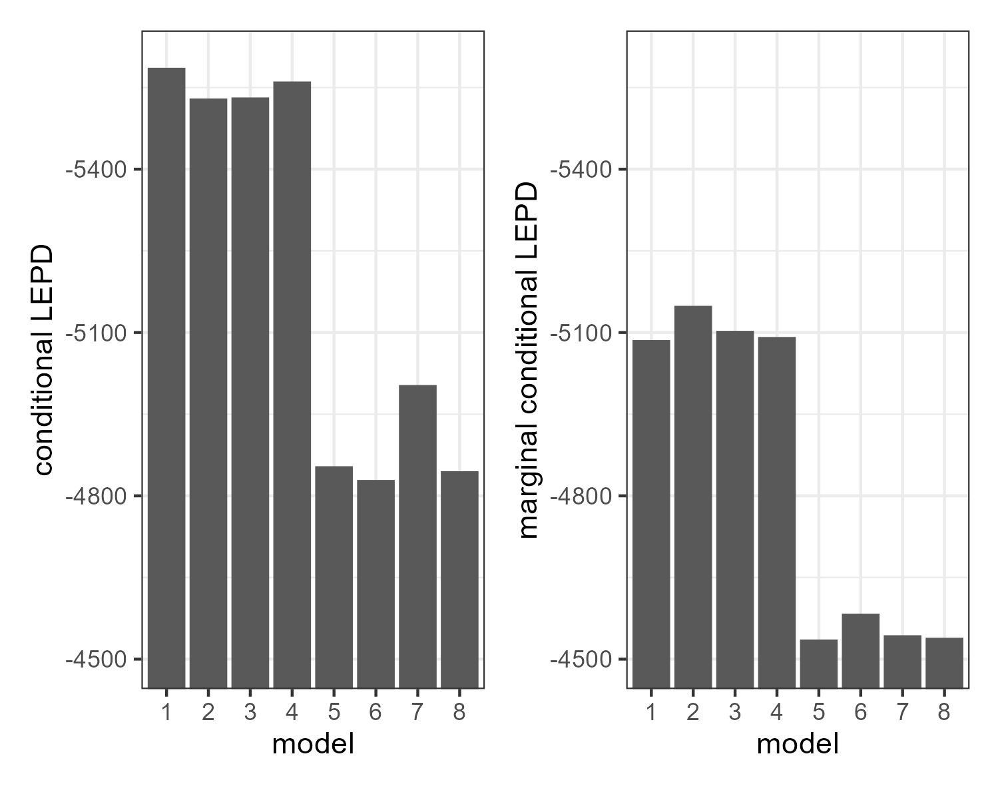

A multivariate Bayesian longitudinal model for ERC thickness and
cognitive capacity
================
Jesse Birchfield
2023-11-20

## section 1

Example equation:
$$f(x) = \frac{1}{\sqrt{2\pi}\sigma} e^{-\frac{1}{2}(\frac{x-\mu}{\sigma})}$$

Example code:

``` r
d <- dnorm(0, 0, 1) %>% round(3)
d
```

    ## [1] 0.399

We can show that something is code by enclosing it in backticks. Above
we used the function `dnorm()`.

We can run inline code by enclosing it in backticks starting with `r`:
the value of `d` is 0.399.

The value of `dnorm(0, 0, 1)` is 0.3989423.

## section 2

> Here is a block quote.

Here is a horizontal line:

------------------------------------------------------------------------

Now it’s time for an image:



------------------------------------------------------------------------

<div class="figure" style="text-align: center">


<p class="caption">
Tux
</p>

</div>
